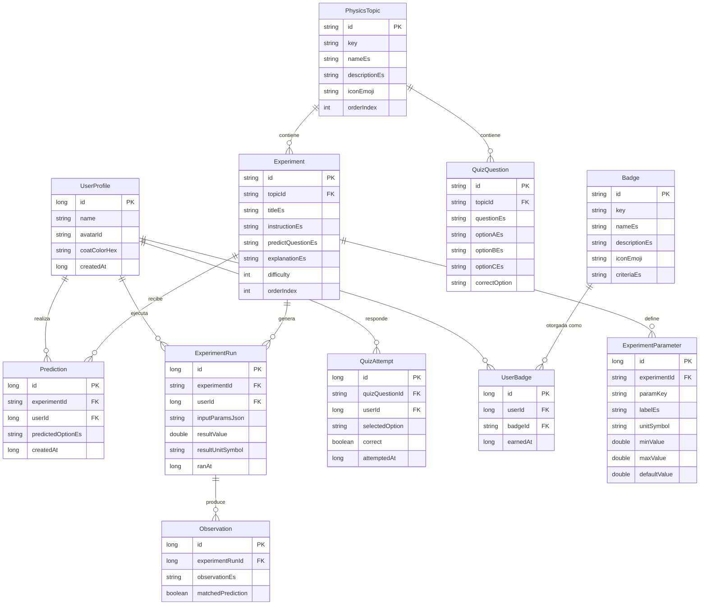

# Base de datos — Física Lab

Motor: **Room (SQLite)**, 100% local, sin sincronización remota. 11 tablas.

## Diagrama entidad-relación

## Descripción de tablas

### `user_profile`
Perfil del científico junior. La app usa el perfil más reciente
(`ORDER BY id DESC LIMIT 1`) como perfil activo; el esquema permite varios
perfiles aunque la UI de la v1.0.0 solo gestiona uno a la vez.

### `physics_topic`
Los 8 temas de física (Movimiento, Velocidad, Fuerza, Masa, Gravedad,
Fricción, Energía, Máquinas simples), con su nombre, descripción, ícono y
orden de aparición en la pantalla de Laboratorios.

### `experiment`
Los 24 experimentos guiados, 3 por tema. Incluye el título, la instrucción,
la pregunta de predicción y la explicación final, todo en español.

### `experiment_parameter`
Los controles ajustables (sliders/chips) de cada experimento: qué parámetro
es (`paramKey`), su etiqueta en español, su unidad, y su rango
mínimo/máximo/por defecto.

### `prediction`
La predicción que el niño elige antes de correr un experimento (etapa
"Predice"), asociada al experimento y al usuario.

### `experiment_run`
Cada vez que el niño corre un experimento (etapa "Experimenta"), se guarda
aquí: los parámetros usados (como JSON simple), el resultado numérico y su
unidad, y la fecha de ejecución. El progreso ("X de 24 experimentos") se
calcula contando experimentos **distintos** completados por el usuario.

### `observation`
La comparación entre la predicción y el resultado real (etapa "Observa"),
incluyendo si la predicción coincidió con el resultado (`matchedPrediction`).

### `quiz_question`
Las 30 preguntas de opción múltiple (A/B/C) del cuaderno de científico,
repartidas entre los 8 temas.

### `quiz_attempt`
Cada respuesta que el niño da en el quiz, con si fue correcta o no.

### `badge`
Las 8 insignias coleccionables, con su criterio de obtención en español.

### `user_badge`
Registro de qué insignias ganó cada usuario y cuándo.

## Archivos SQL

- [`database/schema.sql`](database/schema.sql) — sentencias `CREATE TABLE`
  equivalentes al esquema de Room, para quien quiera inspeccionar o recrear
  la base de datos fuera de Android.
- [`database/sample_data.sql`](database/sample_data.sql) — un subconjunto de
  datos de ejemplo (algunos temas, experimentos y preguntas) en formato SQL
  puro, útil como referencia rápida sin tener que leer los archivos Kotlin
  de semilla completos.

La fuente de verdad real de los datos en la app es el código Kotlin en
`app/src/main/java/com/kidslab/physicslab/data/seed/`, que se ejecuta la
primera vez que se abre la app.
